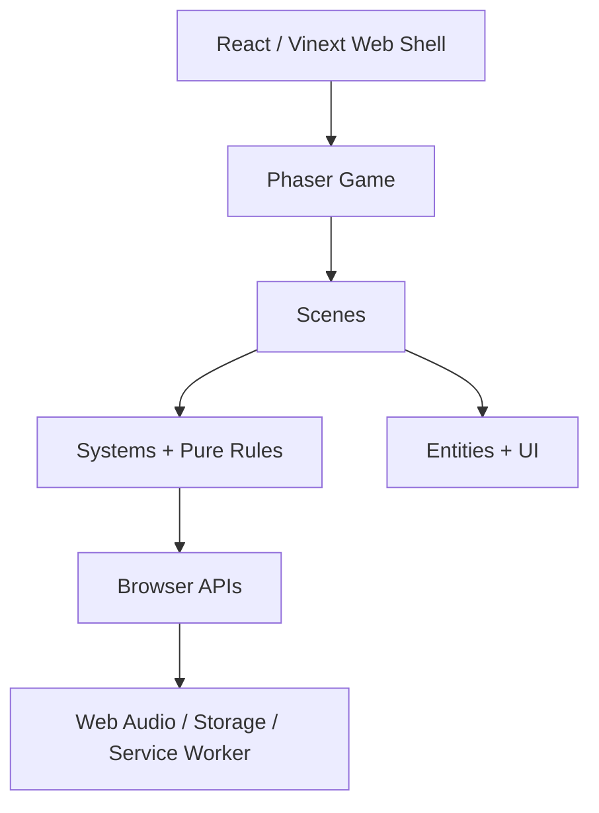
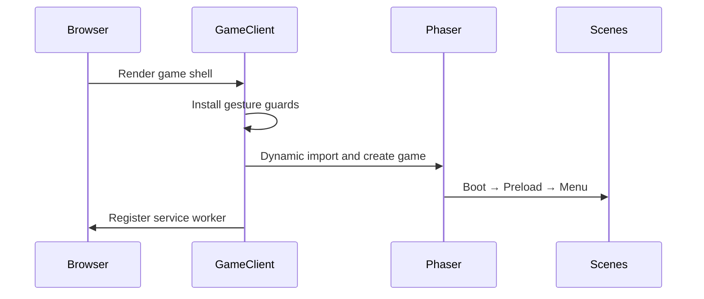
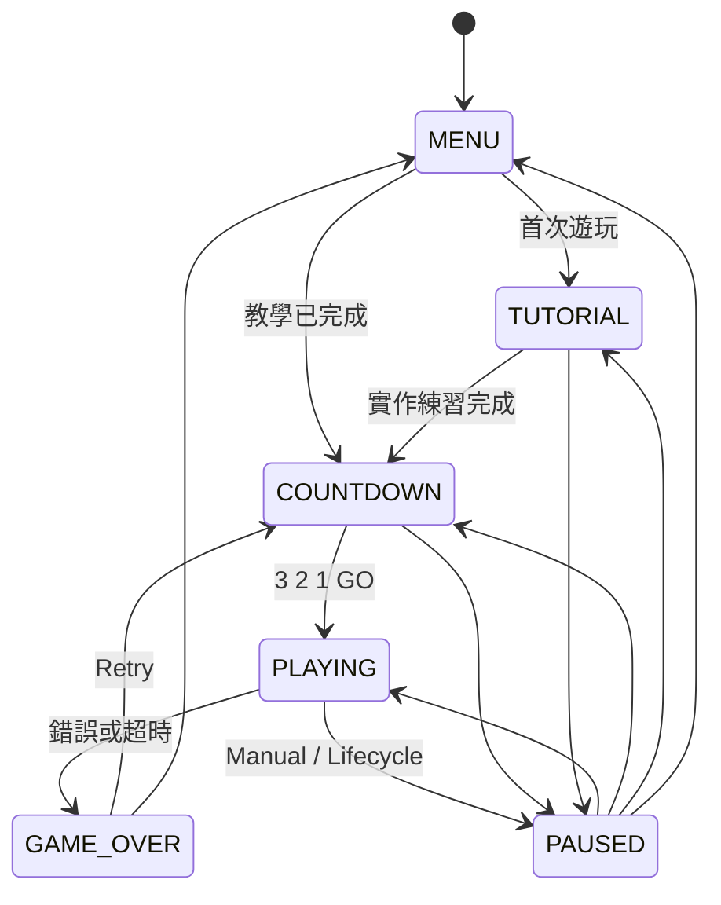
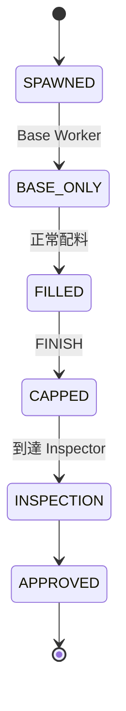
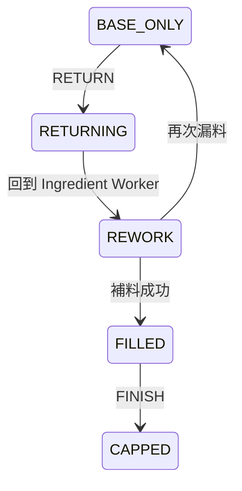
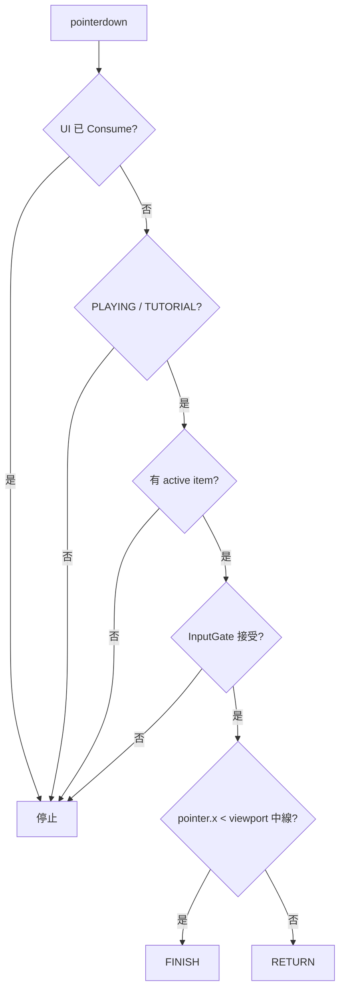
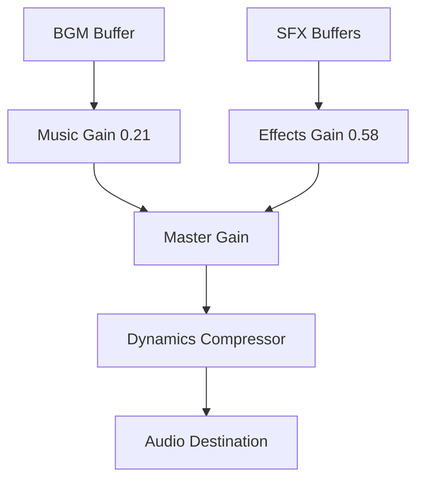

# 《天陽的漢堡工廠》V1 技術文檔

> 版本：1.0.0  
> 本文件描述 V1 實際 Runtime 行為，不是未實作的設計提案。

## 目錄

- [1. 系統總覽](#1-系統總覽)
- [2. 啟動流程](#2-啟動流程)
- [3. Scene Architecture](#3-scene-architecture)
- [4. Game State](#4-game-state)
- [5. Food State Machine](#5-food-state-machine)
- [6. 每幀 Gameplay 流程](#6-每幀-gameplay-流程)
- [7. Split Touch 輸入系統](#7-split-touch-輸入系統)
- [8. Active Item 與超時](#8-active-item-與超時)
- [9. 整線 RETURN 系統](#9-整線-return-系統)
- [10. Difficulty、Spawn 與 Score](#10-difficultyspawn-與-score)
- [11. Layout、DPR 與畫面解析度](#11-layoutdpr-與畫面解析度)
- [12. UI 與 Event Bus](#12-ui-與-event-bus)
- [13. Lifecycle 與 Restart](#13-lifecycle-與-restart)
- [14. Audio Architecture](#14-audio-architecture)
- [15. Storage Schema](#15-storage-schema)
- [16. PWA 與 Offline](#16-pwa-與-offline)
- [17. 效能設計](#17-效能設計)
- [18. 測試覆蓋](#18-測試覆蓋)
- [19. 關鍵檔案與相依方向](#19-關鍵檔案與相依方向)

## 1. 系統總覽



系統分成兩層：

- Web Shell：Metadata、PWA、CSS viewport、Phaser 掛載與卸載。
- Phaser Runtime：Scene、遊戲狀態、輸入、渲染、音訊、儲存與生命週期。

設計原則：

- 每幀 Gameplay 不透過 React re-render。
- 規則盡量放在無 Phaser Scene 相依的純函式中。
- 版面資料由 LayoutManager 單一產生。
- Gameplay timing 全部使用 delta time。
- 食品由固定 Object Pool 重複使用。

## 2. 啟動流程



實際步驟：

1. `app/page.tsx` 渲染 `GameClient`。
2. `GameClient` 安裝 `gesturestart`、`gesturechange`、`touchmove` 防護。
3. Dynamic import `src/main.ts`，避免 Server Render 載入 Phaser DOM 相依。
4. `DisplayManager` 先計算 render scale。
5. `new Phaser.Game(makeGameConfig(...))` 建立高解析度 Canvas。
6. `BootScene` 初始化 Layout。
7. `PreloadScene` 載入背景與所有音訊 binary。
8. `MenuScene` 顯示主選單。
9. HTTPS 環境註冊 Service Worker。

React effect cleanup 會移除瀏覽器 listener 並呼叫 `game.destroy(true)`。

## 3. Scene Architecture

| Scene | 職責 |
|---|---|
| `BootScene` | 初始化 Layout 與背景色，進入 Preload |
| `PreloadScene` | 顯示載入條，預載背景與音訊，註冊 encoded audio |
| `MenuScene` | 品牌主選單、Best、Start、玩法說明與 Mute |
| `GameScene` | Gameplay 狀態、食品、輸送帶、輸入、判定、退回、分數與生命週期 |
| `UIScene` | HUD、教學、Touch Feedback、Pause、Game Over、Debug Overlay |

`GameScene` 啟動後會 Launch `UIScene` 並把它置於最上層。兩者透過全域 `gameEvents` 溝通，不直接互相持有物件參考。

## 4. Game State



`GameState` 定義於 `GameTypes.ts`。Pause 會記錄 `stateBeforePause`，恢復時回到原狀態，而不是一律回到 PLAYING。

## 5. Food State Machine

主要正常路徑：



退回路徑：



失敗路徑：

- `BASE_ONLY + FINISH` → `FAILED`
- `FILLED + RETURN` → `FAILED`
- 可操作食品越過 `deadlineX` → `FAILED`

實作細節：

- Runtime 把缺料可操作狀態統一表現為 `BASE_ONLY`。
- `DEFECTIVE` 仍保留在 enum 與 evaluator 相容範圍，但目前 `markIngredientProcessed(true)` 直接設定 `BASE_ONLY`。
- `PLAYER_STATION` 是語意保留狀態；V1 以位置範圍選 active item，不需要切換至此狀態。
- `FoodItem.redraw()` 依 state 重新繪製輪廓與狀態符號。
- `inspected` 與 `ingredientProcessed` 是獨立旗標，避免只靠 state 推導歷史事件。

## 6. 每幀 Gameplay 流程

`GameScene.update()` 將 delta 限制在最大 50 ms，降低背景喚醒或卡頓後單幀跨越過大的風險。

PLAYING 更新順序：

1. 若整線正在 Return，僅執行 `updateLineReturn()`。
2. 依當前分數取得 Conveyor Speed。
3. 更新輸送帶視覺 offset。
4. 逐一更新 active FoodItem 的 delta-time 位移。
5. 經過 Base Worker 時成為 `BASE_ONLY`。
6. 經過 Ingredient Worker 時以 RNG 決定 `FILLED` 或保持缺料。
7. 檢查是否越過 deadline。
8. `CAPPED` 抵達 Inspector 時批准、計分、速度提示。
9. Approved Food 延遲 170 ms 回收到 Pool；隱藏出料則立即回收。
10. 更新以距離為基準的 SpawnManager。

位移公式：

```ts
item.x += speed * layout.motionScale * deltaSeconds;
```

## 7. Split Touch 輸入系統

輸入鏈：



責任分工：

- `InputManager`：以 `pointer.id + downTime` 標記 UI 已消耗事件。
- `InputGate`：42 ms Lock 與單一 accepted pointer。
- `SplitTouchController`：驗證 state、active item、動態中線並 Dispatch。
- `GameScene.dispatchAction()`：執行教學或正式 Gameplay 規則。

中線計算：

```ts
viewportX + viewportWidth * 0.5
```

Canvas 內部座標會隨 render scale 與 orientation resize，因此不可使用固定 X。

Pointer Up 只用來釋放 accepted pointer，不用來觸發動作。

## 8. Active Item 與超時

`pickClosestActiveItem()` 的候選條件：

- `active === true`
- `ingredientProcessed === true`
- state 是 `FILLED` 或 `BASE_ONLY`
- X 位於 `actionStartX..actionEndX`

若多顆候選同時存在，選與 `playerStationX` 距離最近者。

V1 Layout：

```ts
actionStartX = playerStationX - ACTION_LEAD * uiScale;
actionEndX = deadlineX;
deadlineX = inspectorX + INSPECTOR_PASS_MARGIN * uiScale;
```

目前常數：

- `ACTION_LEAD = 52`
- `INSPECTOR_PASS_MARGIN = 22`

因此判定不是窄線，而是從玩家工作站之前延伸到最右側 Inspector 之後的寬區域。正式畫面不渲染判定線；只有 Debug Overlay 會顯示 Action Zone。

超時條件使用嚴格大於：

```ts
x > deadlineX
```

食品剛好位於 deadlineX 時仍可操作。

## 9. 整線 RETURN 系統

`LineReturnController` 是不依賴 Phaser Physics 的確定性狀態機：

```text
IDLE → REWINDING → REWORKING → IDLE
```

### 9.1 等距回捲

每幀計算：

```ts
shiftedDistance = min(remainingDistance, currentSpeed * deltaSeconds)
```

再對所有 active item 執行：

```ts
item.x -= shiftedDistance
```

所有食品減去完全相同的值，因此任兩顆食品的 X 差保持不變。輸送帶視覺與 SpawnManager 同步減去相同距離。

### 9.2 回捲速度

傳入的 `returnSpeed` 是當前 `DifficultyManager.speedForScore(score) * motionScale`，與正向輸送帶使用相同速度。

### 9.3 出料防誤判

回捲開始前，`returnOutfeedDisposition()` 檢查玩家右側食品：

| 狀態 | 處理 |
|---|---|
| `CAPPED` 且尚未檢查 | `HIDE`，保留邏輯與後續計分 |
| `INSPECTION`／`APPROVED`／已 inspected | `REMOVE` |
| 未完成或仍可能操作 | `KEEP` |

隱藏的 CAPPED 食品仍跟著產線位移；回到正向流程後抵達 Inspector 時正常計分並立即回收，但不會再顯示成可判斷目標。

### 9.4 再次漏料

正式遊戲 Rework 完成時：

```ts
rate = min(0.05 + score * 0.004, 0.62)
```

最多允許連續兩次 skip；第三次強制補料成功。Tutorial 不套用 skip，確保玩家第一次練習能完成。

## 10. Difficulty、Spawn 與 Score

### 10.1 Speed

```ts
speed = min(
  START_SPEED
  + score * SCORE_SPEED_STEP
  + floor(score / 10) * TEN_SCORE_BONUS,
  MAX_SPEED,
)
```

V1 數值：

- Start 128
- 每分 +2
- 每 10 分額外 +4
- Max 465

Speed Up 提示分數：10、25、50、75、100、150、200。提示不暫停 Gameplay。

### 10.2 Spawn

SpawnManager 以「已行進距離」而不是固定 Timer 產生食品：

```ts
travelled += travelSpeed * deltaSeconds
```

達到 `layout.spawnGap` 時產生一顆，並保留 overflow，避免不同 FPS 逐步累積間距誤差。

`spawnGap` 至少為：

```ts
max(BASE_GAP * motionScale, actionZoneWidth + safetyGap)
```

V1 `BASE_GAP = 205`。

### 10.3 Score

只有 CAPPED Food 真正通過 Inspector 才 `score + 1`。FINISH／RETURN 當下不加分。

`ScoreManager` 保存本局起始 Best，讓 `isNewBest` 能正確判斷；每次新最高分立即寫入 localStorage。

## 11. Layout、DPR 與畫面解析度

### 11.1 Internal Resolution

Phaser Scale 使用 `NONE`，由 DisplayManager 直接控制：

```text
internalWidth  = CSS width  × renderScale
internalHeight = CSS height × renderScale
```

Canvas CSS 尺寸仍覆蓋完整 viewport。

### 11.2 Render Scale

```ts
renderScale = max(
  1,
  min(devicePixelRatio, 3, sqrt(6_000_000 / cssPixels)),
)
```

效果：

- 一般現代手機可使用 3× 內部解析度。
- 最大約 600 萬內部像素，避免大型高 DPR 裝置造成 GPU 壓力。
- Phaser Text 額外使用 `renderScale × 1.35`，最高 resolution 4。

### 11.3 LayoutManager

LayoutManager 集中產生：

- Portrait／Landscape。
- Safe Area。
- Gameplay Rect 與 Half Width。
- Conveyor、四個 Worker Station、Action Zone、Deadline。
- UI scale、motion scale、spawn gap。

Portrait 參考尺寸為 390×844，Landscape 為 844×390。這些只是比例參考，不是固定輸出解析度。

Resize 時 active food X 依新舊寬度比例重排；Line Return destination 與 Spawn progress 也同步更新，不 reload 頁面。

## 12. UI 與 Event Bus

`GameEvents` 是 GameScene 與 UIScene 的公開橋接層：

| Event | 方向／用途 |
|---|---|
| `STATE_CHANGED` | Game → UI：Pause／Game Over 顯示狀態 |
| `SCORE_CHANGED` | Game → HUD |
| `TOUCH_FEEDBACK` | Game → 左右半屏短回饋 |
| `TUTORIAL_STEP` | Game → Tutorial 視覺狀態 |
| `TUTORIAL_NUDGE` | Game → 錯邊提示 |
| `COUNTDOWN` | Game → 倒數文字 |
| `SPEED_UP` | Game → 非阻塞提示 |
| `GAME_OVER` | Game → 結算面板 |
| `PAUSE_REQUEST` | UI → Game |
| `RESUME_REQUEST` | UI → Game |
| `RETRY_REQUEST` | UI → Game |
| `MENU_REQUEST` | UI → Game |
| `DEBUG_UPDATE` | Game → Debug Overlay |

所有 UI listener 都在 UIScene shutdown 時解除；GameScene 的 UI request listener 也在 shutdown 解除。

## 13. Lifecycle 與 Restart

LifecycleManager 監聽：

- `visibilitychange`
- `blur`
- `focus`
- `pagehide`
- `pageshow`
- `orientationchange`
- Phaser Scale Resize

背景切換只會 Pause，不會自動 Resume。Pause 會：

- 設定 `GameState.PAUSED`。
- Reset SplitTouch gate。
- 暫停 Phaser Clock。
- 暫停全部 Tweens。
- 停止 BGM。

Resume 需要使用者手勢，先 `AudioManager.unlock()`，再恢復 Clock、Tween 與原 GameState。

Retry 不 reload Browser；它會 Stop UIScene 並 Restart GameScene。`resetRun()` 與 shutdown 負責：

- Score、Spawner、Line Return、Tutorial state 重設。
- Pool Food 全部 deactivate。
- Timer 與 Tween 清除。
- SplitTouch、Lifecycle listener 銷毀。
- Event Bus listener 解除。
- BGM 停止。

## 14. Audio Architecture

AudioManager 是 Singleton，避免 Scene Restart 建立多個 AudioContext。

Audio Graph：



- AudioContext 使用 `latencyHint: interactive`。
- PreloadScene 以 Phaser binary loader 預載全部音訊。
- 第一次 Start／UI 手勢呼叫 `unlock()` 後才 decode 與播放。
- BGM 使用 looped AudioBufferSourceNode。
- 每次 BGM restart 建立新的 source，舊 source 會 stop、disconnect。
- Codec 解碼失敗時 SFX 使用 procedural fallback tone。
- Mute 寫入 localStorage，Master Gain 以 15 ms 時常平滑切換。

## 15. Storage Schema

Key：

```text
factoryRush.save
```

Schema：

```ts
{
  saveVersion: 2,
  bestScore: number,
  mute: boolean,
  tutorialCompleted: boolean,
  tutorialVersion: number,
}
```

讀取策略：

- JSON 錯誤、Private Browsing 或容量不足都不可阻擋 Gameplay。
- Best Score 正規化為非負數。
- Tutorial 只有在 saved version 等於 current tutorial version 時才視為已完成。
- 升級教學時可提高 `CURRENT_TUTORIAL_VERSION`，讓玩家重新練習一次，Best 與 Mute 不受影響。

## 16. PWA 與 Offline

Manifest：

- `display: standalone`
- `orientation: any`
- 192×192、512×512 maskable icons
- 深色 Theme／Background

Service Worker 採 App Shell Cache：

- Install 時預快取首頁、Manifest、Icons、HD 背景與全部音訊。
- 再解析首頁 HTML，補快取本地 JS／CSS chunk。
- Navigation 使用 Network First，離線回退首頁。
- 靜態資產使用 Cache First，未命中再 Fetch 並寫入 Cache。
- Activate 刪除舊 CACHE_NAME。

每次核心靜態資產更新都應提升 `CACHE_NAME` 版本，避免舊手機持續使用過期檔案。

## 17. 效能設計

- 目標 60 FPS，最低穩定 30 FPS。
- 16 顆 FoodItem 預先建立並重用。
- 不使用 Arcade Physics；所有移動為可預測數值更新。
- 每幀 delta 最大 50 ms。
- 無大型 Shader、Blur、Realtime Lighting 或大量 Particle。
- Worker、Food、Conveyor 使用 Graphics 與輕量 Tween。
- Background 使用兩張方向專用 WebP，避免單張超大 Desktop 圖縮放。
- Spawn 使用距離累積，避免大量 Timer。
- Scene shutdown 完整清理 Timer、Tween 與 Listener。
- Canvas render scale 有 600 萬像素上限。

## 18. 測試覆蓋

V1 自動測試分兩類：

1. Pure Rule Test：直接驗證輸入、判定、Deadline、Return、Spawn、Difficulty、Viewport 與 Render Scale。
2. Rendered HTML Test：載入正式 `dist/server/index.js` Worker，驗證 HTML、Metadata、PWA 與 Game Shell。

純規則與 Runtime 的邊界：

- `GameRules.ts`、`DisplayRules.ts`、`LineReturnController.ts`、`SpawnManager.ts` 與 `DifficultyManager.ts` 可在 Node 測試。
- Phaser 視覺與 Scene 整合目前以 Type Check、Build 與手動行動裝置驗收保障。

新增 Gameplay 規則時，優先把條件抽成純函式再測試，避免只能透過完整 Scene 才能驗證。

## 19. 關鍵檔案與相依方向

| 檔案 | 角色 |
|---|---|
| `src/game/GameTuning.ts` | 全部 Gameplay 常數 |
| `src/game/types/GameTypes.ts` | 狀態與資料契約 |
| `src/game/rules/GameRules.ts` | 判定、active item、Split、InputGate、Outfeed 規則 |
| `src/game/scenes/GameScene.ts` | Runtime Orchestrator |
| `src/game/scenes/UIScene.ts` | UI Orchestrator |
| `src/game/entities/FoodItem.ts` | Food 狀態與視覺 |
| `src/game/systems/SplitTouchController.ts` | 全畫面左右操作入口 |
| `src/game/systems/LineReturnController.ts` | 整線回捲狀態機 |
| `src/game/systems/LayoutManager.ts` | 響應式 Layout 單一真實來源 |
| `src/game/systems/DisplayManager.ts` | 高解析 Canvas 與文字解析度 |
| `src/game/systems/LifecycleManager.ts` | 手機背景、Focus、旋轉生命週期 |
| `src/game/systems/AudioManager.ts` | Web Audio、Mute、BGM、SFX |
| `src/game/systems/StorageManager.ts` | Save migration 與 localStorage |
| `tests/game-rules.test.ts` | 核心 Gameplay 回歸保障 |

建議相依方向：

```text
Types / Tuning
      ↓
Pure Rules / Small Systems
      ↓
Entities / UI Components
      ↓
GameScene / UIScene
      ↓
Phaser Bootstrap / Web Shell
```

避免讓 Pure Rules 反向依賴 Scene、DOM 或 React；這能維持測試速度與規則可讀性。
