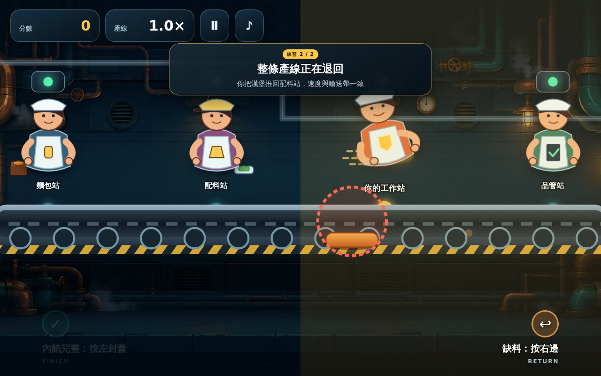
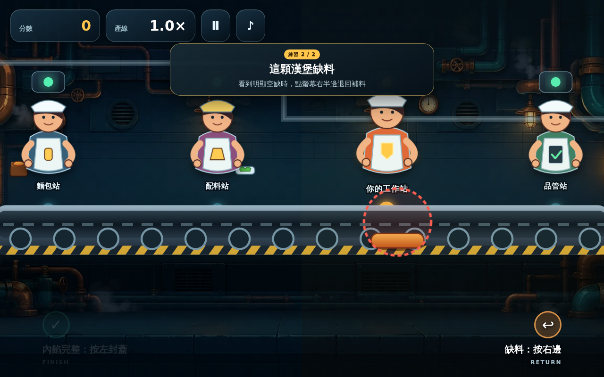

# 🤖 《天陽的漢堡工廠》03_安卓版_Grok開發 (角色動作額外增強版)

> **版本基準**：以原版 Android HD v1.1.7 (Xiaomi Pad Mini 適配版) 為底包  
> **更新日期**：2026-08-21  
> **核心原則**：獨立分支開發，嚴格保持原版網頁 (`01_網頁版_Web_V1.0.0`) 與原版安卓 (`02_安卓版_Android_HD`) 的純淨與原樣。

---

## 📸 角色動作與玩法預覽

| 1. 玩家蓋漢堡皮 (`FINISH`) | 2. 玩家推回瑕疵品 (`RETURN`) | 3. 配料站放料 / 偷懶漏料 |
| :---: | :---: | :---: |
|  |  |  |

| 4. 教學引導：完整封蓋 | 5. 教學引導：缺料退回 | 6. 30秒 3Blue1Brown 介紹動畫 |
| :---: | :---: | :---: |
|  |  | [🎬 觀看 30s 介紹動畫 (9:16)](./04_介紹動畫/天陽的漢堡工廠_30秒介紹_3Blue1Brown版_9x16.mp4) |

---

## 🌟 本分支主要創新與特色

1. **全新角色動作導演系統 (`CharacterActionDirector`)**：
   - **Station 1 (麵包站 `worker-base`)**：`acting-place` (500ms) 連帶放置底部麵包。
   - **Station 2 (配料站 `worker-fill`)**：`acting-place` 正常放料；`acting-skip` (400ms) 搞笑偷懶漏料 (`DEFECT_RATE = 0.18`)。
   - **Station 3 (玩家站 `worker-player`)**：
     - 按左（封蓋 `FINISH`）：觸發 `acting-cap` (440ms) 手臂骨架蓋頂部麵包。
     - 按右（退回 `RETURN`）：觸發 `acting-push` (520ms) 手臂推回第二位重做。
   - **Station 4 (品管站 `worker-inspector`)**：`acting-stamp` (360ms) 檢驗合格蓋章。
   - 接近判定區時具備 `anticipating` 預備姿勢動畫。

2. **精準點擊與死區修復**：
   - 修正舊版在平板高解析度下約 1.2 秒的操作死區。
   - 引入核心常數 `ACTION_FILL_CLEAR = 18`（判定起點為 `fillX + 18` 倍縮放值）。
   - 引入 `INPUT_LOCK_MS = 42`（防連擊抖動與狀態鎖定保護），並完善 `setPointerCapture` / 釋放機制。

3. **失誤警鈴與聲光反饋系統**：
   - 玩家背後設有 `PlayerSignal` 燈號塔：平時為工作黃燈，失誤時觸發 `line-alarm` 紅燈閃爍與 `alarm-wash` 全場紅光洗幕。
   - 播放獨立 `alarm.wav`（單次觸發不循環、音量 0.84），觸發時 BGM 智慧淡降至 0.06，1.2 秒後結算畫面立即停止警報。

4. **工廠精緻化美術與 HUD 放大**：
   - 新增不鏽鋼牆面、磁磚、管線、吊燈、蒸氣粒子 (`steam-layer`)、傳送帶高光 (`belt-sheen`) 與得分爆破效果 (`scoreBurst`)。
   - 平板模式下 HUD 分數顯著放大至 38px，操作鈕面積加大提升觸控舒適度。

---

## 📂 子目錄結構

```text
03_安卓版_Gork開發/
├─ 01_APK_安裝檔/
│  └─ Tianyang-Burger-Factory-HD-Xiaomi-Pad-Mini-v1.1.7-角色動作額外.apk (獨立自簽名版)
├─ 02_開發原始碼/
│  └─ 角色動作額外/
│     ├─ android-svg/       # TypeScript/SVG 原始碼 (含 package.json, tsconfig.json)
│     ├─ www/               # 完整編譯且含音訊/圖資之 Web 即開即玩版本 (可在瀏覽器直接運行)
│     └─ web-extras/        # 角色骨架動作模組 (workers.tsx, character-actions.ts)
├─ 03_動作截圖/             # 5 張高解析動作關鍵幀 PNG 及 ZIP 備份
├─ 04_介紹動畫/             # 3Blue1Brown 風格 30 秒 9:16 直式介紹影音 MP4
├─ 05_開發手冊/             # 完整解碼 Markdown 手冊與 docx/txt
└─ README.md
```

---

## 📱 安卓安裝與簽名須知

* 本 APK 使用專屬 Keystore 進行 Android v2 + v3 完整簽名。
* **重要**：若您的裝置（如 Xiaomi Pad Mini）上已安裝過原版 `v1.1.0 ~ v1.1.7`，因簽名公鑰不同，安裝時系統會提示「套件與現有應用程式衝突」，**請先將原版 App 卸載後，再安裝本 APK**。

---

## 🛠️ 開發與編譯方式

本專案可以直接在瀏覽器運行 `02_開發原始碼/角色動作額外/www/index.html`，亦可使用 TypeScript 重新編譯：

```bash
cd 02_開發原始碼/角色動作額外/android-svg
npm install
npm run build
```
