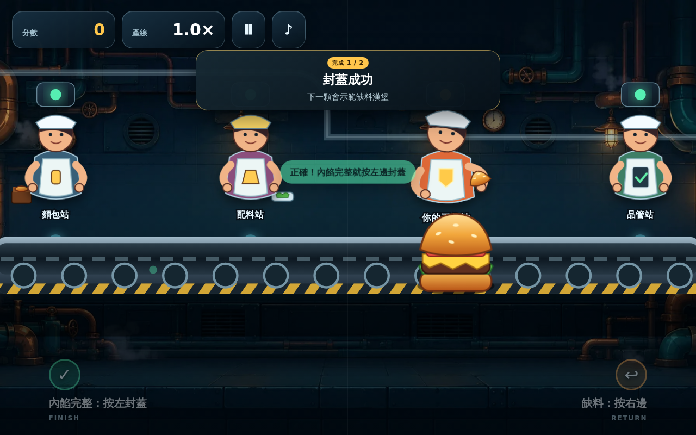
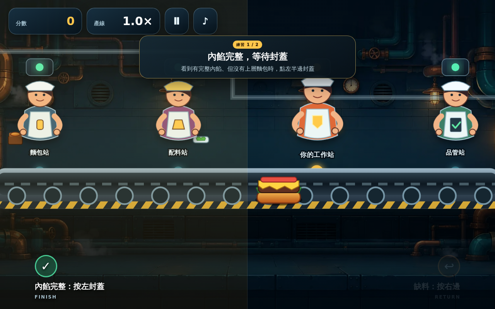
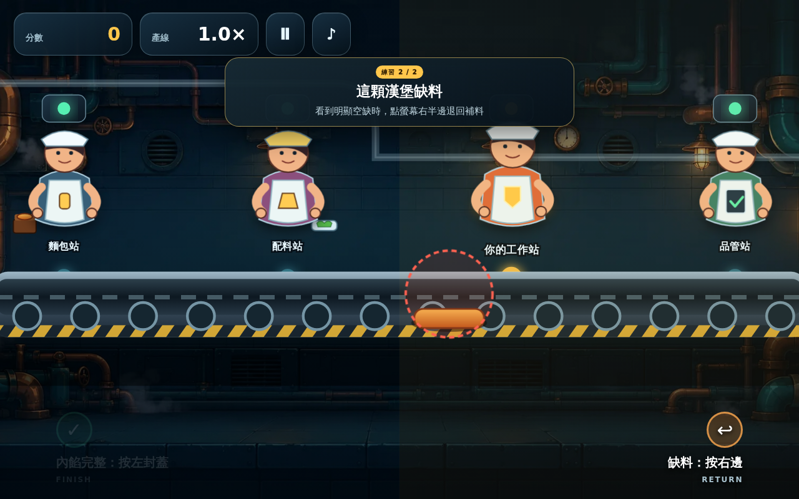

# 🍔 《天陽的漢堡工廠》完整專案 (Tianyang'\''s Burger Factory)

<p align="center">
  
</p>

<p align="center">
  
  
  
  
  
  
</p>

---

## 📖 專案簡介 (Introduction)

《天陽的漢堡工廠》是一款節奏明快、考驗即時反應力的工廠產線裝配街機風格遊戲。玩家扮演產線上的第三位核心員工——**「封蓋／品管站」**，必須在漢堡高速通過傳送帶的瞬間，精準判斷漢堡內餡是否齊全，做出「封蓋出貨」或「退回重做」的極速決策！

本倉庫採用**嚴格模組化與三階獨立分支隔離結構**，完整收錄了網頁版、安卓 HD 版以及由 Grok 獨立開發的角色動作增強版本。

---

## 🏛️ 專案架構與分類目錄 (Repository Architecture)

本專案母目錄嚴格遵循各版本獨立隔離原則，互不混放：

```text
天陽的漢堡工廠_完整專案（網頁版＋安卓版）/
├── 📁 01_網頁版_Web_V1.0.0            # 🌐 原始網頁版 (純淨保留，維持原樣)
│   ├── 01_完整專案/                   # 網頁版 V1.0.0 完整源碼 ZIP 與 Git 歷史 bundle
│   ├── 02_開發文件/                   # README, DEVELOPMENT, TECHNICAL
│   ├── 03_AI維護Skill/                # 專案專屬 AI Skill 與 prompt 配置
│   ├── 04_美術素材/                   # 原始圖片與 SVG 向量素材包
│   ├── 05_音訊素材/                   # 8-bit / 晶片音效與 BGM 素材包
│   └── 06_發布資訊/                   # SHA256SUMS 校驗碼與發布說明
│
├── 📁 02_安卓版_Android_HD            # 📱 原始安卓 HD 歷代版本 (純淨保留，維持原樣)
│   ├── 01_APK_安裝檔/                 # v1.1.0 ~ v1.1.7 歷代 APK 安裝包 (含 Xiaomi Pad Mini 版)
│   ├── 02_完整開發原始碼/             # v1.1.0 ~ v1.1.7 各版本源碼 ZIP 封裝
│   └── 03_開發與安裝文件/             # Android SVG 建置說明與 Xiaomi Pad Mini 適配手冊
│
└── 📁 03_安卓版_Gork開發              # 🌟 Grok 專屬獨立角色動作增強版 (最新演進)
    ├── 01_APK_安裝檔/                 # 角色動作額外 APK (v1.1.7-extra，獨立 v2/v3 簽名)
    ├── 02_開發原始碼/
    │   └── 角色動作額外/
    │       ├── android-svg/           # TypeScript/SVG 原生架構源碼 (含 package.json)
    │       ├── www/                   # 即開即玩 Web 發布包 (內建全音訊與 HD 圖資)
    │       └── web-extras/            # 骨架手臂動作模組 (workers.tsx, character-actions.ts)
    ├── 03_動作截圖/                   # 5 張高解析動作關鍵幀截圖 (PNG + ZIP)
    ├── 04_介紹動畫/                   # 30秒 3Blue1Brown 風格 9:16 直式介紹動畫 (MP4)
    ├── 05_開發手冊/                   # 完整解碼 Markdown 手冊 (架構/簽名/動畫)
    └── README.md                      # Grok 分支專屬說明文件
```

---

## 🎮 玩法規則與產線配置 (Gameplay & Stations)

<p align="center">
  
  
</p>

在漢堡工廠傳送帶上，漢堡依序流經 4 個工作站：

| 站點編號 | 角色 / 站名 | 職責與動作機制 | 視覺與動作反饋 |
| :---: | :--- | :--- | :--- |
| **第 1 站** | 麵包站 (`worker-base`) | 自動在輸送帶起點投放漢堡底層麵包。 | `acting-place` (500ms) 遞送底皮。 |
| **第 2 站** | 配料站 (`worker-fill`) | 正常投放肉排與蔬菜；有 18% 機率 (`DEFECT_RATE=0.18`) 偷懶漏放！ | `acting-place` 正常放料；`acting-skip` (400ms) 漏料縮手。 |
| **第 3 站** | **玩家站 (`worker-player`)** | **【核心操作】**<br>🟢 **內餡完整** ➜ **點擊左鍵／按左鍵 (`FINISH`)** 蓋上頂層麵包。<br>🔴 **缺料瑕疵** ➜ **點擊右鍵／按右鍵 (`RETURN`)** 將空漢堡退回給第 2 站。 | `acting-cap` (440ms) 雙手扣蓋；<br>`acting-push` (520ms) 手臂推回。 |
| **第 4 站** | 品管站 (`worker-inspector`) | 終端品質把關，合格品蓋章放行；漏網瑕疵品即刻判定 Game Over。 | `acting-stamp` (360ms) 垂直蓋章。 |

---

## ⚡ Grok 開發版核心亮點 (Key Innovations in Grok Branch)

1. **純 SVG 骨架動作系統 (`CharacterActionDirector`)**：
   - 採用純向量 DOM/SVG + CSS Transform 變形矩陣，零外部圖片素材負擔，達成 60 FPS 極致流暢表現。
   - 漢堡接近時具備 `anticipating` 預備姿勢動畫。
2. **點擊判定修復與防抖機制**：
   - `ACTION_FILL_CLEAR = 18`：精確以 `fillX + 18` 倍縮放座標判定進料，徹底消除平板環境下的 1.2 秒無效操作死區。
   - `INPUT_LOCK_MS = 42`：防連點抖動保護與精確 PointerCapture 事件生命週期管理。
3. **失誤警鈴與聲光反饋**：
   - 玩家身後增設 `PlayerSignal` 警報燈塔：平時為工作黃燈，失誤時觸發 `line-alarm` 紅燈爆閃與 `alarm-wash` 全場紅光警示。
   - 智慧音訊調控：觸發 `alarm.wav` 時 BGM 自動微降至 0.06，1.2 秒後切入結算畫面時自動靜音止鈴。
4. **Xiaomi Pad Mini (8.8" 3008×1880, 16:10) 旗艦適配**：
   - 工廠場景增加不鏽鋼反射壁、吊燈、蒸氣粒子層 (`steam-layer`)、傳送帶光澤 (`belt-sheen`)。
   - HUD 分數文字放大至 38px，操作觸控熱區擴大。

---

## 🚀 快速開始與運行方式 (Quick Start)

### 1. 網頁版即開即玩 (Web Browser)
直接在現代瀏覽器（Chrome / Edge / Firefox / Safari）中開啟以下檔案即可享受具備音效與動作的完整遊戲：
* 路徑：[`03_安卓版_Gork開發/02_開發原始碼/角色動作額外/www/index.html`](./03_安卓版_Gork開發/02_開發原始碼/角色動作額外/www/index.html)

### 2. 安卓 APK 安裝 (Android Device)
* 檔案位置：[`03_安卓版_Gork開發/01_APK_安裝檔/Tianyang-Burger-Factory-HD-Xiaomi-Pad-Mini-v1.1.7-角色動作額外.apk`](./03_安卓版_Gork開發/01_APK_安裝檔/)
* **安裝注意事項**：
  > ⚠️ **重要提示**：本額外版本採用獨立 Keystore 與 Android v2+v3 簽名。若裝置先前已安裝原版 `v1.1.x` APK，系統會因簽名公鑰不同判定衝突。**請務必先卸載原版 App 後，再安裝本 APK。**

### 3. 源碼編譯 (TypeScript Build)
```bash
# 進入 SVG 源碼目錄
cd "03_安卓版_Gork開發/02_開發原始碼/角色動作額外/android-svg"

# 透過 TypeScript 編譯輸出至 www/game.js
npm install
npm run build
```

---

## 🎬 30 秒 3Blue1Brown 風格介紹動畫

本專案收錄了以數學幾何動畫風格（3Blue1Brown / Manim 風格）製作的 30 秒 9:16 直式介紹短影音：
* 影片檔：[`03_安卓版_Gork開發/04_介紹動畫/天陽的漢堡工廠_30秒介紹_3Blue1Brown版_9x16.mp4`](./03_安卓版_Gork開發/04_介紹動畫/天陽的漢堡工廠_30秒介紹_3Blue1Brown版_9x16.mp4)
* 製作詳情請參閱：[03_介紹動畫製作.md](./03_安卓版_Gork開發/05_開發手冊/03_介紹動畫製作.md)

---

## 📄 開源授權 (License)

本專案基於 [MIT License](./LICENSE) 條款開放開源使用。
